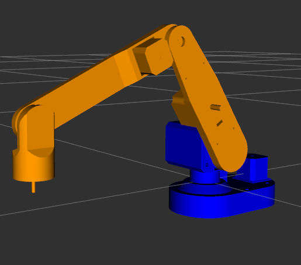

# Protobot

Package to use Protobot, the 3D printed 5-DOF robot.



## Required packages

* ros_control
* gazebo_ros_control

### Installation

``` - Linux terminal
sudo apt-get install ros-kinetic-ros-control ros-kinetic-ros-controllers
sudo apt-get install ros-kinetic-gazebo-ros-pkgs ros-kinetic-gazebo-ros-control
```